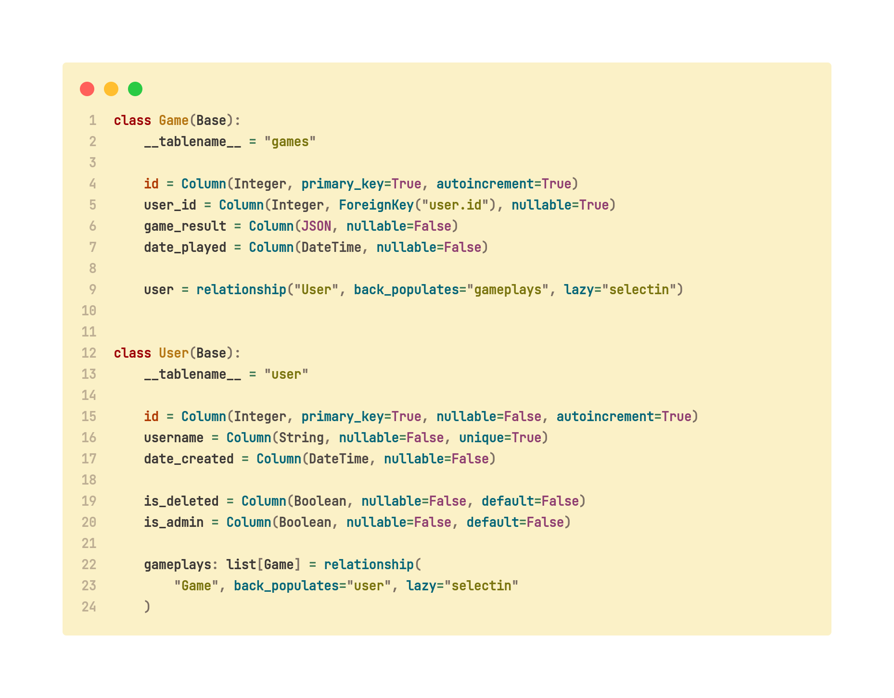
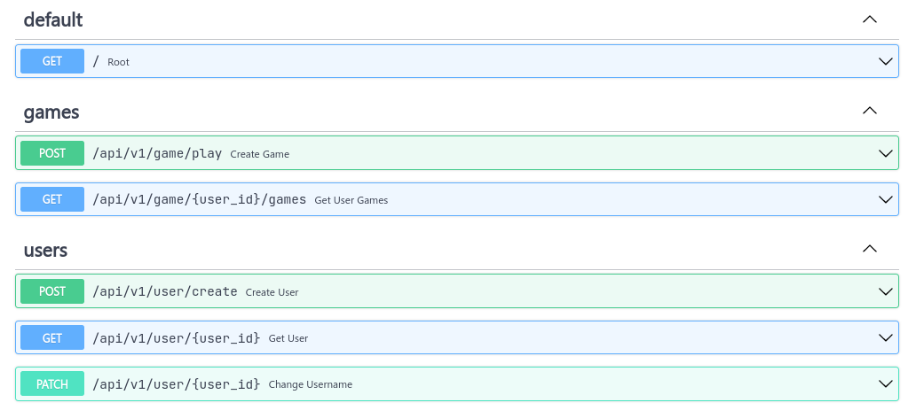
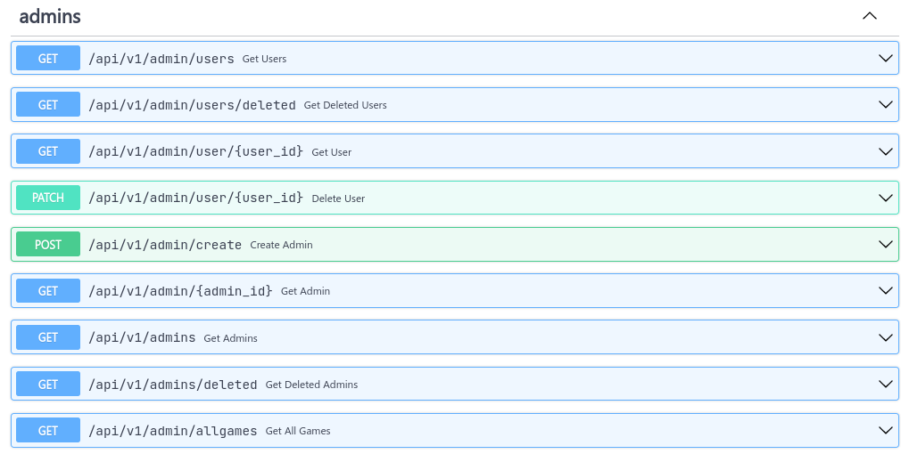

# RPS Remote Simulator

>I know you are probably wondering what RPS means.
>It is a highly dedicated **Monte-Carlo Simulation** of probabilistic sampling values, trained and pipelined to run on a fastapi endpoint constructor, serving responses to routes for the game of Rock Paper Scissors.
>Yes, Rock Paper Scissors, what did you think it was going to be? And I am proud I made you all that. I will not be hosting this masterpiece, but you can test it out on your local machine.

## Quick Start

- Clone the repository

    ```bash
    git clone https://github.com/blackprince001/RPS-Remote-Simulator
    ```

- Move into the directory

    ```bash
    cd RPS-Remote-Simulator
    ```

- Set up a virtual environment with Venv on Vscode or any python environment manager you have installed, and it will automatically install the dependencies. This project uses pipenv to handle dependency installs and virtual environments.

- To simply install project dependencies, you have to run the following commands.

  ```bash
  poetry shell
  ```

  The above command inits a python virtual environment in your current directory. Then you proceed to do;

  ```bash
  poetry install
  ```

  to install all dependencies!

- Set up a dev environment by running the command to install dependencies to work on the project. Do note that the make command is already dependent on the one above. So if you use this command, there will be no need for you to run the prev one.
  
  ```bash
  poetry install --with dev
  ```

  while you're in `/RPS-Remote-Simulator`

## Testing

To run the tests in the project:

- You need to install the dev packages:

  ```bash
  poetry install --with dev
  ```

## Api Routes

<!--  -->

### Client Side



### Adminstration side



### Future updates

- [ ] Include Export as file types for the game data.

- [ ] Make the api more generic for the primary usage of providing human simulated data for any form Linear Regression Learning.

## File Structure for Project

> The project is not complete. I was going to use this and other later projects to learn about FastApi and backend engineering concepts, but School is around the corner, and I will come back to these projects when I have free time!

```console
.
├── LICENSE
├── README.md
├── app.py
├── docs_assets
│   ├── first.png
│   ├── models.png
│   └── second.png
├── poetry.lock
├── pyproject.toml
├── routers
│   ├── __init__.py
│   ├── admin_end.py
│   ├── game_end.py
│   └── user_end.py
├── rps_remote_simulator
│   ├── __init__.py
│   ├── database
│   │   ├── __init__.py
│   │   ├── core.py
│   │   └── models.py
│   ├── errors.py
│   └── game.py
├── schemas
│   ├── __init__.py
│   ├── game.py
│   └── user.py
├── tests
│   ├── __init__.py
│   ├── conftest.py
│   ├── test_api
│   │   ├── __init__.py
│   │   ├── test_admin.py
│   │   └── test_user.py
│   ├── test_game
│   │   ├── __init__.py
│   │   └── test_game.py
│   └── test_schemas
│       ├── __init__.py
│       ├── test_game_schema.py
│       └── test_user_schema.py
└── utils
    ├── __init__.py
    └── utils.py

11 directories, 33 files
```
